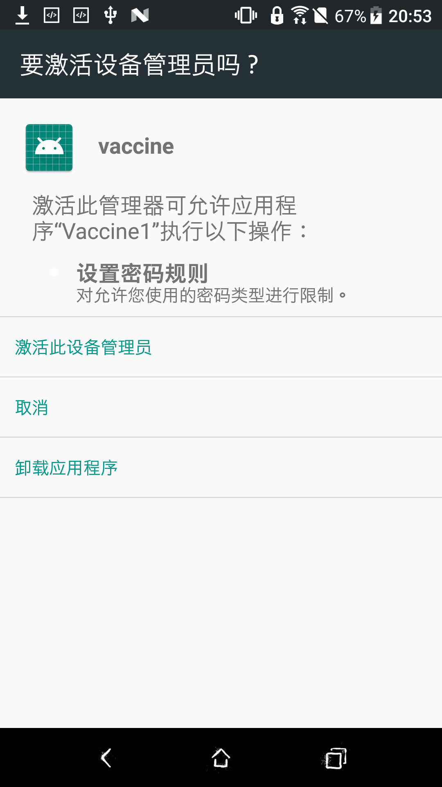
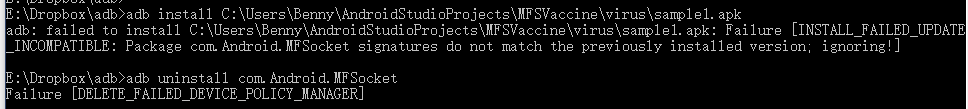

# NoMFS
MFSocket疫苗

# 原理
相同包名、签名却不同的应用无法同时安装，当加入设备管理员之后卸载也需要取消设备管理员权限

# 使用方法
## 安装
安装v1.apk、v2.apk，通过`adb install path_to_file.apk`或者复制文件均可

*Play保护机制可能会警告，请允许安装*

## 开启设备管理员
设置-安全-设备管理员，勾选vaccine1，然后激活此设备管理员（程序并不会强制任何密码规则，请放心操作）

同理，开启vaccine2的设备管理员

# 效果
## adb无法安装也无法卸载

# 致谢
https://github.com/HiedaNaKan/FuckMFS

# 许可证
MIT